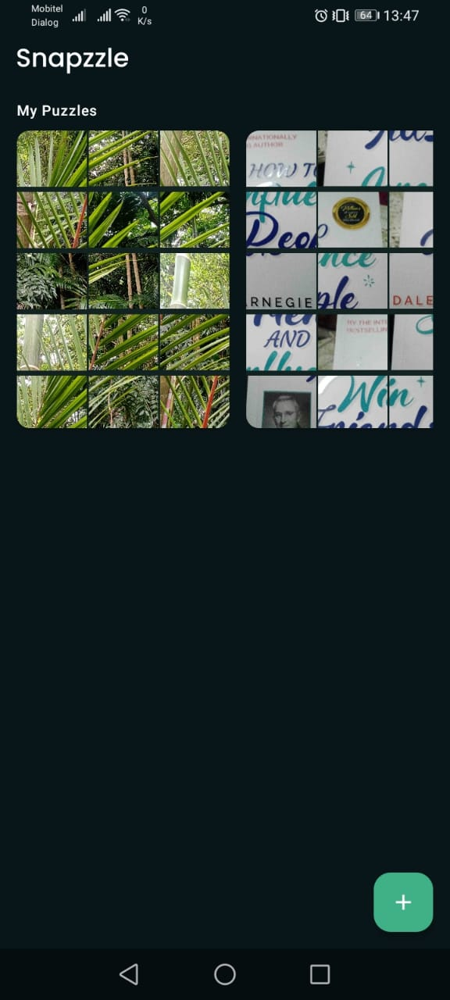
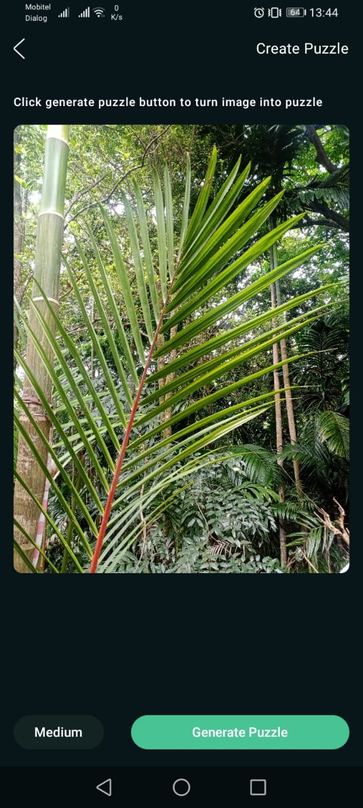
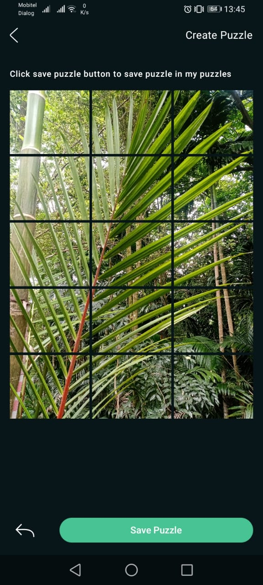
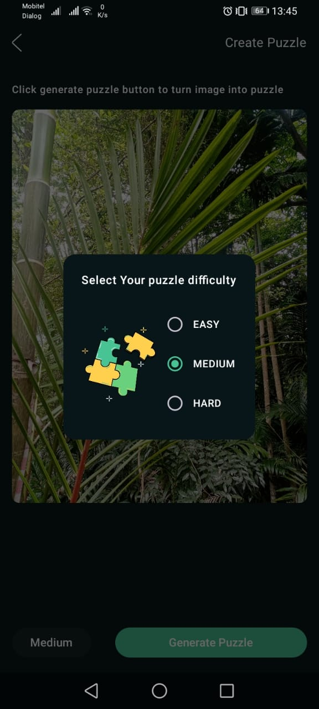
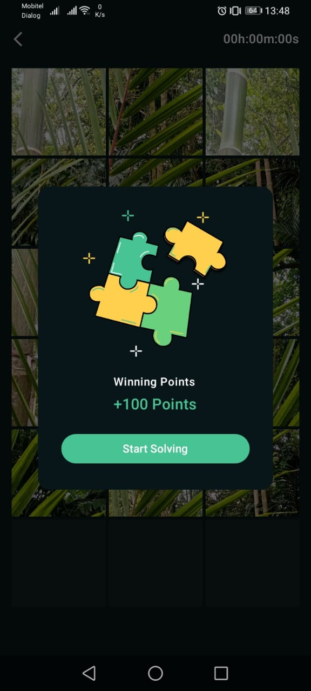

# Snapzzle

Snapzzle is an innovative mobile app that allows users to take a photo and transform it into a puzzle. The app lets users solve the puzzle by reassembling the pieces of the photo. Whether you want to challenge yourself or have fun with your favorite images, Snapzzle turns every photo into an exciting puzzle game!

## Features

- **Capture Photos**: Take a picture with the built-in camera.
- **Puzzle Mode**: Automatically converts photos into a puzzle with customizable difficulty levels (easy, medium, hard).
- **Interactive UI**: Intuitive drag-and-drop interface to solve the puzzle.
- **Shuffle Pieces**: Every time you open the puzle it will automaticly shuffle.

## Technologies Used

- **Programming Language**: Kotlin
- **UI Framework**: Jetpack Compose
- **Database**: Room Database for saving puzzle progress and custom puzzles
- **Image Processing**: Custom algorithms to split images into puzzle pieces
- **State Management**: Jetpack Compose's state management tools

## Screenshots

## Screen Recording

